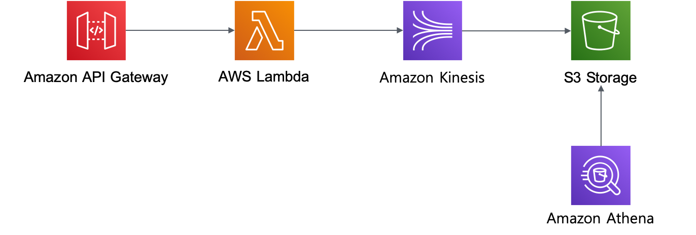

# aws-serverless-data-pipeline-by-terraform
   



**AWS Serverless Data Pipeline example by Terraform**

- AWS Serverless Data Pipeline by Terraform ( API Gateway + Lambda + Kinesis + S3 + Athena )

## Include
This terraform code include All-In-One for AWS Serverless Data Pipeline

- API Gateway
- Lambda
- Kinesis
- S3
- Athena

## Customize main.tf in terraform code
``` HCL
  workspace      = "dev"
  aws_account_id = "1111111111111"
  region         = "${var.region}"
  service_name = "testservice"

  // api gateway method
  apigw_method = "POST"

  // kinesis firehose option
  s3_buffer_size = 5
  s3_buffer_interval = 300

  // glue table patition
  columns = {
    id = "int"
    type = "string"
    status = "int"
    created_at = "timestamp"
  }
```

## Steps after apply terraform

1. Send 'JSON Data' to API Gateway with API key.
```
curl -X POST \
  https://xxxxxxxxxx.execute-api.us-east-1.amazonaws.com/dev/testservice \
  -H 'Content-Type: application/json' \
  -H 'x-api-key: xxxxxxxxxxxxxxxxxxxxxxxxxxxxxxxxxxxxxxxxxxx' \
  -d '{"id": 1, "type": "click", "status": 0, "created_at": "2019-02-26 04:00:00"}'
```

2. Query your 'JSON Data' in Athena.
- Added partition to metastore
``` SQL
MSCK REPAIR TABLE testservice_logs;
```
- Get your data
``` SQL
SELECT * FROM testservice_logs;
```
